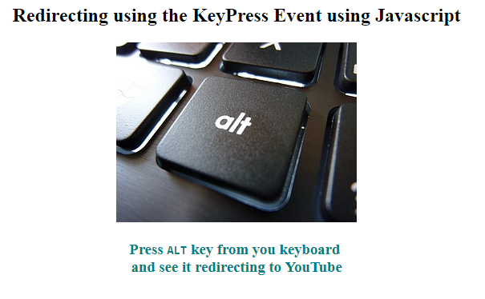

<h1>JSKeyPress</h1>
<h3>Redirect to a specific website when a key is press from your keyboard while you are browing this page</h3>
<h3>Here i have used <code>ALT</code> as the key but you can basically use any key from your keyboard, all you have to find is the right keycode for that specific key.
 

For demo go <a href="https://asangam.github.io/JSKeyPress/" target="_blank">here.</a>
 
To get the keycode of any keyboard visit <a href="http://keycode.info/" target="_blank">here.</a>
 </h3>

